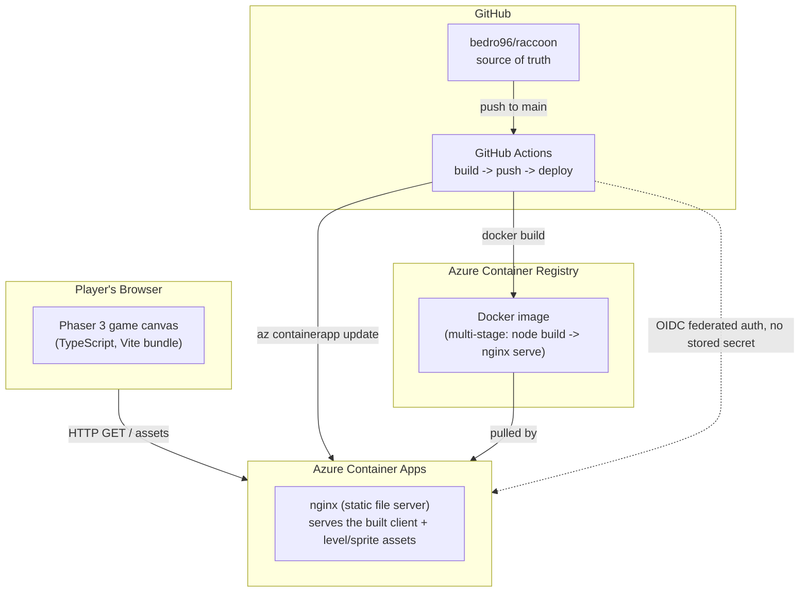
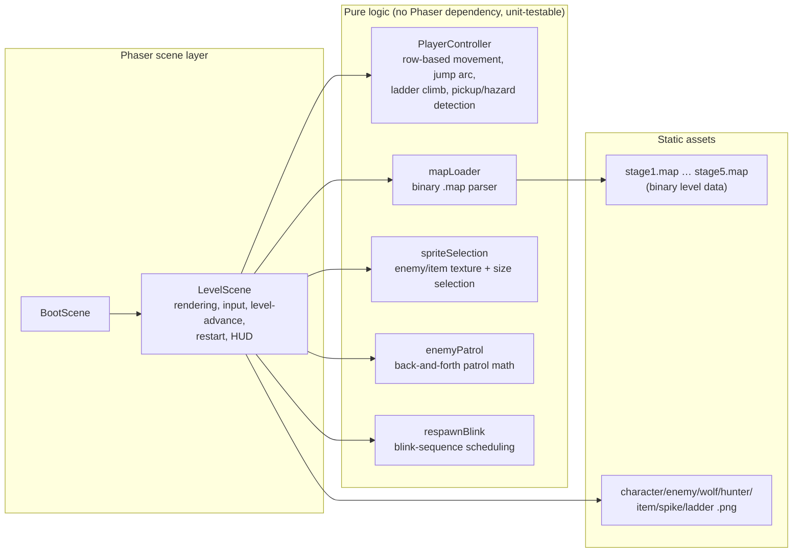

# Ponpoko (web reimplementation)

A browser-playable reimplementation of **Ponpoko**, a legacy C++/DirectX9 platformer
([grujam/Ponpoko](https://github.com/grujam/Ponpoko)), rebuilt from scratch in
TypeScript + [Phaser 3](https://phaser.io/), containerized, and deployed to
Azure Container Apps with a fully automated CI/CD pipeline.

You play a raccoon climbing platforms and ladders across a growing campaign of
levels, dodging enemies and spikes, collecting fruit, before the run ends in a
GAME COMPLETE screen.

**Live demo:** https://ca-ponpoko-test.victoriousmeadow-7f1c906a.eastus.azurecontainerapps.io

---

## Architecture



### Client architecture (inside the Phaser game)



### Repo layout

```
client/
  src/
    game/            # pure, Phaser-free logic (unit-tested directly)
      PlayerController.ts   # movement/jump/climb/fall + hazard & pickup detection
      mapLoader.ts          # binary .map format parser (see below)
      spriteSelection.ts    # which sprite/size to render for an item or enemy
      enemyPatrol.ts        # patrol back-and-forth math
      respawnBlink.ts       # blink-on-death sequence scheduling
      constants.ts          # all tuned physics/geometry constants
      types.ts              # MapData / ItemData / EnemyData shapes
    scenes/
      BootScene.ts     # brief boot flash, then hands off to LevelScene
      LevelScene.ts    # the whole game loop lives here
      PlayScene.ts     # early movement-only test harness (superseded by LevelScene)
  scripts/             # plain TS/Python scripts -- this project's test suite
    verify-*.ts        # deterministic logic tests, run via `tsx`, no test framework
    generate-*.py      # level-file authoring scripts (there's no in-browser map editor)
  public/assets/
    levels/*.map       # binary level data (stage1.map … stage5.map)
    sprites/*.png      # game art
  Dockerfile           # multi-stage: node build -> nginx serve
infra/                 # Terraform: resource group, ACR, Container Apps environment/app
.github/workflows/deploy.yml   # build -> push to ACR -> az containerapp update
```

### The binary `.map` level format

Levels are hand-authored binary files matching the *original* C++ game's exact
in-memory struct layout (reverse-engineered from the reference repo, not
redesigned) — little-endian, a flat dump of counted arrays:

```
int    nStageLevel
float  StartPos.x, StartPos.y
[int count][Platform  x count]   -- float y, startX, endX            (12 bytes each)
[int count][Ladder    x count]   -- float x; int floor                (8 bytes each)
[int count][Spike     x count]   -- float x, y                        (8 bytes each)
[int count][Item      x count]   -- float x, y; int type, score      (16 bytes each)
[int count][Enemy     x count]   -- float x, y, patrolRange          (12 bytes each)
```

`mapLoader.ts` parses this directly in the browser (`fetch` → `ArrayBuffer` →
`DataView`). New levels are authored with small Python generator scripts
(`client/scripts/generate-*.py`) that pack the same binary layout — there's no
in-browser map editor, mirroring how the original game only ever shipped a
handful of hand-built levels.

### Game world & physics

4 discrete platform rows (Y = 270/390/510/630px) plus a floor (750px, always
spans the full width) and ceiling — movement is **row-based**, not continuous
gravity: falling and ladder-climbing are timed linear interpolations between
rows, and jumping is a fixed-duration parabolic arc with horizontal
displacement that does **not** change row. A same-row jump can bridge a gap
between two platform segments up to `JUMP_DISTANCE` px wide — this matters a
lot for level design (see the workflow section below).

Enemy sprite is selected by **level index**, not per-enemy data (the original
binary format has no per-enemy "kind" field): Levels 1–2 render the original
green enemy, Levels 3–4 render a wolf, Level 5 renders a hunter with a gun —
all three share identical patrol/collision behavior, purely a visual swap.

---

## How this was built: the Matt Pocock workflow

This project was built end-to-end by an AI agent (GitHub Copilot CLI) using a
specific, deliberate engineering workflow — not ad-hoc prompting. Each phase
below maps to a distinct skill/discipline that was actually invoked during
development, in the order it happened.

### 1. Wayfinder — charting the destination before building anything

The very first step wasn't code — it was a **wayfinder map**: a single
tracking issue ([#24](../../issues/24)) whose body pinned down the
*destination* ("a deployed, playable, faithful web reimplementation on Azure
Container Apps"), recorded settled decisions, and — critically — tracked
**fog of war**: things known to be relevant but not yet sharp enough to
ticket (e.g. "does audio parity matter?" — resolved as a *fact*, not a
decision, once the reference repo was inspected and found to have no audio at
all).

A **grilling** session (structured Q&A, one round of clarifying questions at
a time) locked in the initial scope: web stack (Phaser), which parts of the
original game to keep (core mechanics) vs. drop (map editor, multiplayer),
and infra choices (Terraform, Container Apps, GitHub Actions) — before a
single line of game code existed.

The map then broke into an initial set of **AFK research and task tickets**
with explicit blocking edges (reverse-engineer the original format → scaffold
the client → implement physics → build the level loader → …), each resolved
one at a time, each recording its answer back onto the map before the next
ticket started.

### 2. To-tickets / to-issues — every new request becomes vertical slices

Every subsequent round of feature requests (bug fixes, new enemies, new
levels, new maps) went through the same discipline: **break the request into
independently-gradable, vertical-slice issues** before writing any code.

Each issue:
- describes **end-to-end behavior**, not a layer-by-layer task list
- declares its **blocking edges** explicitly (e.g. "add wolf enemy" blocked
  nothing; "create Level 3" was blocked by "add wolf enemy", since it needed
  that rendering support to exist first)
- is scoped to be demoable/verifiable **on its own**

This consistently produced many thin issues rather than a few thick ones —
e.g. a single "add wolf and banana" request became 4 separate issues (jump
rotation fix, wolf+banana support, Level 3, Level 4), each independently
reviewable and mergeable.

### 3. TDD — red before green, even for a game

Every piece of *pure logic* (physics constants, patrol math, blink
scheduling, sprite selection, map parsing) lives in small Phaser-free
TypeScript modules specifically so it can be unit-tested without a browser.
The project has no test framework — just plain scripts
(`client/scripts/verify-*.ts`) run via `tsx`, each printing PASS/FAIL per
assertion and exiting non-zero on failure. The discipline was genuinely
followed, not just claimed:

- Speed and jump-rotation-direction changes updated the *test's expected
  value first*, confirmed it **failed** against the unchanged code, then
  changed the code and confirmed **green**.
- Features with real state machines (enemy patrol, the 3-blink respawn
  sequence) got dedicated pure functions (`enemyPatrol.ts`, `respawnBlink.ts`)
  extracted specifically so their timing/bounds logic could be asserted
  deterministically, rather than only checked by eyeballing a screenshot.

### 4. Rubber-duck review — before every single merge, no exceptions

No branch merged to `main` without an independent review pass from a
rubber-duck reviewer agent, and it repeatedly caught real problems, not
rubber-stamped:

- A generated banana sprite rendered as an unrecognizable hollow ring — caught
  and fixed before merge.
- A "3-blink on death" feature initially played its blink sequence *after*
  the player had already silently teleported back to the spawn point — caught
  and fixed by deferring the respawn until the blink sequence completes.
- Level 3's layout initially *looked* broken (5 of 10 platform segments
  unreachable by ladders alone) until the reviewer's own independent
  graph analysis accounted for the fact that a same-row jump can bridge an
  80px gap — every gap in that level happened to be exactly 80px, so the
  level was fully playable all along. This lesson was then written directly
  into every subsequent level-design ticket's instructions.
- Twice, a branch was found to have been cut *before* a sibling feature
  merged, so merging it as-is would have silently reverted that sibling
  feature (once for the hunter enemy, once suspected for a sprite fix) —
  caught by diffing against the *latest* `main`, not the branch's own base,
  and fixed by rebasing before merge.

### 5. Fleet mode — parallel execution via isolated git worktrees

Independent issues were implemented **concurrently** by separate background
agents, each in its own `git worktree` on its own branch — never multiple
agents editing the same working directory at once. Issues with a blocking
edge (e.g. "Level 3" blocked by "wolf support") waited for their blocker to
merge before their worktree was even created; independent issues (e.g. the
jump-rotation fix and the wolf/banana feature) ran side by side from the
start.

Where two parallel branches both needed to touch the same line (most often
`LEVEL_URLS`, the ordered list of level files, since every new level appends
to it), the expected `git rebase` conflict was resolved by hand at merge
time — flagged upfront in each issue's description so it was never a
surprise.

### 6. Ship it — smoke test against the real, deployed URL

The GitHub Actions pipeline (`.github/workflows/deploy.yml`) builds the
Docker image, pushes it to Azure Container Registry, and rolls the Container
App to the new image via OIDC federated Azure login (no stored client
secret) on every push to `main`. After each merge, the live production URL
was hit directly with a headless-browser smoke test — not just the local
build — checking for console errors, confirming the specific fix was
visible (a reversed jump tilt, a cleaned-up sprite, a new level's assets
present with the right byte count), before considering an issue truly done.

---

## Running it yourself

```bash
cd client
npm install
npm run dev              # local dev server
npm run build             # production build
npm run verify:physics    # ...and five more verify:* scripts — the test suite
```

Infra is managed via `infra/*.tf` (Terraform, Azure provider) and deploys
automatically on push to `main` via `.github/workflows/deploy.yml`.
